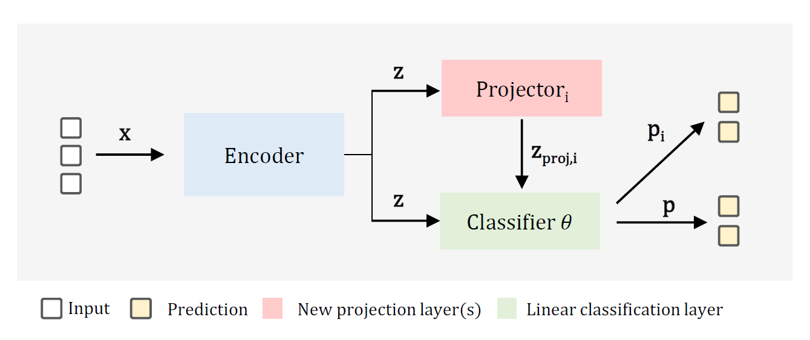

# Simple Latent Uncertainty Representation

### [Standard benchmarks](/benchmarks/readme.md) | [LUR implementation](#implementation) | [NuScenes labels](/nuscenes/readme.md)
> **For a toy-regression, boston housing example or MNIST out-of-distribution benchmarks, check the benchmarks folders**

### Paper Abstract
Deep neural networks (DNNs) are effective for video recognition and driving automation tasks but face challenges in safety-critical applications given their inability to express uncertainty. We propose a simple latent uncertainty representation (LUR) framework. LUR is a deterministic uncertainty estimation approach that does not require alterations to existing DNN components. We assess the impact of the number of projected latent representations and explore various strategies for learning these representations. We report state-of-the-art performance for the video-based AIDE driver action recognition and for the Brain4Cars driver intention recognition (DIR) benchmarks, and introduce a new DIR benchmark for the NuScenes dataset. Additionally, we introduce out-of-distribution benchmarks for each of the datasets. The top-performing LUR models match and occasionally surpass the performance of sampling, ensemble, and deterministic probabilistic deep learning methods.



### TLDR:
The introduction of trainable projection layers and updating the loss function to guide the learning of the projected latent representations can enable a regular DNN to produce uncertainty estimates.  


## Implementation
Integrating LUR into standard models is simple, and requires adding the projection layers and updating the forward pass. 

**Original architecture:**
```python 
class MLP(nn.Module):
    def __init__(self, in_features, out_features):
        super().__init__()
        self.input = nn.Linear(in_features, 8)
        self.hidden1 = nn.Linear(8, 16)
        self.hidden2 = nn.Linear(16, 8)
        self.output = nn.Linear(8, out_features)
        self.activation = nn.ReLU()

    def forward(self, x, y=None):
        x = self.activation(self.input(x))
        x = self.activation(self.hidden1(x))
        x = self.activation(self.hidden2(x))
        return self.output(x)
```
**Modified architecture:**
```python 
class LUR_MLP(nn.Module):
    def __init__(self,
                 in_features,
                 out_features,
                 num_projections):
        super().__init__()
        self.input = nn.Linear(in_features, 8)
        self.hidden1 = nn.Linear(8, 16)
        self.hidden2 = nn.Linear(16, 8)
        self.projections = nn.ModuleList([nn.Linear(8, 8) for _ in range(num_projections)])
        self.output = nn.Linear(8, out_features)
        self.activation = nn.ReLU()

    def forward(self, x):
        z_representations, y_projections = [], []
        x = self.activation(self.input(x))
        z = self.activation(self.hidden1(x))
        z = self.activation(self.hidden2(x))

        for i, proj in enumerate(self.projections):
            z_p = self.activation(proj(z))
            z_representations.append(z_p)
            y_projections.append(self.head(z_p))

        y = self.output(z)
        if self.training:
            return y, y_projections, z_representations
        else:
            return y, y_projections 
```

**LUR loss function intuition:**
```python
loss = criterion(input=pred, target=labels) + (lambda_zproj_loss * torch.stack([criterion(pred, labels) for pred in y_projections]).sum()) + (lambda_kl * kl_div) 
```
